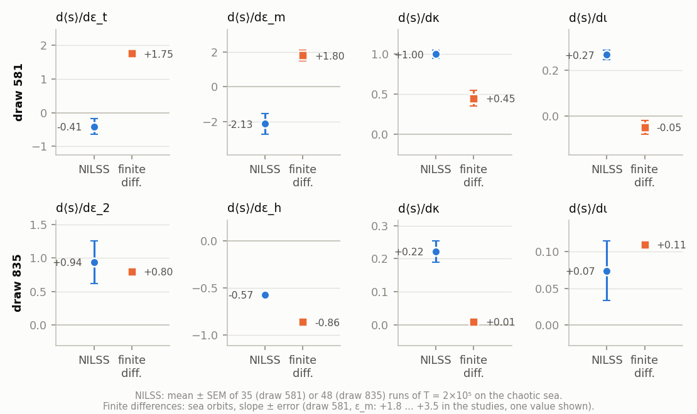
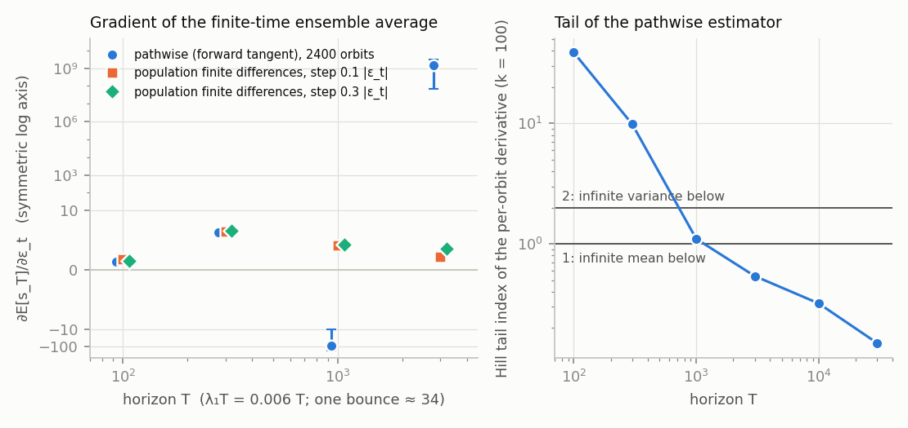
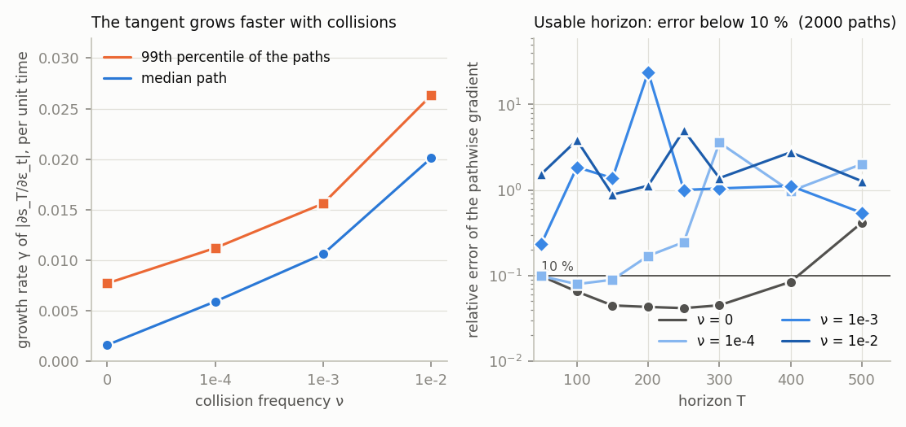

# Findings: sensitivities of the guiding-center flow

This is the summary of the studies that shaped `nilss_jax`: NILSS applied to the guiding-center (GC) motion of charged particles in a
stellarator-like field, checked against finite differences, and compared with the other gradient estimators one would try
(pathwise tangent gradients of finite-time objectives, and the same with collisions). Every number below is in the stored summaries
([experiments/reference_results/](../experiments/reference_results/)); the scripts that produced them are described in
[experiments/README.md](../experiments/README.md). The conclusions are about this toy field and about the parameter sets named here: read
the [caveats](#caveats) before generalising.

## 1. The system

The equations are the `gc_vac` mode of SIMSOPT and FIRM3D (the Littlejohn Lagrangian in Boozer coordinates `(s, theta, zeta)`, vacuum field,
`I = 0`, `K = 0`, `G` constant), implemented in `nilss_jax.systems.guiding_center`:

```
ds/dt     = -B_theta W
dtheta/dt =  B_s W + iota v_par B / G
dzeta/dt  =  v_par B / G
dv_par/dt = -(iota B_theta + B_zeta) mu B / G,        W = kappa (v_par^2 / B + mu)
```

with speed `v = 1` (so `mu = lam / 2`), energy `E = v_par^2 / 2 + mu B` conserved, and the analytic field

```
B = 1 + sqrt(s) [ eps_h cos(theta - N zeta) + eps_t cos(theta) + eps_2 cos(theta - N2 zeta) ] + eps_m cos(N zeta).
```

`eps_h` alone is the first-order near-axis field of SIMSOPT's `BoozerAnalytic` and is quasi-helically symmetric; `eps_t`, `eps_m` and `eps_2`
break the symmetry. The model of `legacy/app_gc.py` (the original repository) is the 3D passing-particle form of the same flow,
`v_par = +sqrt(1 - lam B)` eliminated through the energy, with `kappa = 2 / lam`.

* **With one helical symmetry the flow is integrable.** When `B` depends on `theta - N zeta` only (`eps_t = eps_m = eps_2 = 0`) the energy and
  `G v_par / B - (iota - N) s / kappa` are both conserved: two invariants of the four-dimensional flow `(s, theta, zeta, v_par)`, so the orbits lie on two-dimensional
  surfaces, there is no chaos, and the NILSS assumptions (a positive exponent, an ergodic attractor) cannot hold. The tests check both invariants (`tests/test_gc_official.py`).
* **Breaking the symmetry gives a mixed phase space.** KAM tori, island chains and sticky regions coexist with a chaotic sea; it is bounded (the particle
  stays inside the plasma) only for trapped and barely passing particles. In a random scan of 960 parameter draws (field amplitudes and helicities,
  `kappa`, `iota`, initial condition), about 1 % had a bounded chaotic orbit, with a leading Lyapunov exponent `lambda_1` between 0.003 and 0.007 (one
  bounce of a trapped particle takes about 34 time units). The flow is Hamiltonian: the density `1 / (B v_par)` is invariant, so there is no attractor.

## 2. Two chaotic regimes

The scan draws that were chaotic over `T = 2e5` for several initial conditions were kept; the two with the best ergodicity are used throughout
(parameters in `nilss_jax.systems.guiding_center.load_draw`):

| | draw 581 | draw 835 |
|---|---|---|
| symmetry breaking | `eps_t = 0.0335`, `eps_m = 0.0176`, `eps_2 = 0.0074` (`N2 = 4`) | `eps_2 = 0.0118` (`N2 = 3`) only |
| other parameters | `eps_h = 0.125`, `N = 2`, `iota = 0.775`, `kappa = 0.157`, `lam = 1.026` | `eps_h = 0.108`, `N = 1`, `iota = 0.329`, `kappa = 0.071`, `lam = 0.985` |
| chaotic sea | `s` in 0.008 ... 0.28 (trapped and barely passing) | `s` up to 0.1, hugging the axis |
| `lambda_1` | about 0.006 | about 0.003 |
| mixing over `T = 2e5` | copy-to-copy scatter of `<s>` is 2.8 x the sampling error of one run: not fully mixed | equal to the sampling error: well mixed |

## 3. NILSS against finite differences

`nilss_jax` (streaming, several parameters at once, tangents on the energy surface, `nus = 1`, `T_seg = 200`, `dt = 0.01`, `T = 2e5` after a spin-up of
6000) was run from initial conditions on the sea: 35 usable runs for draw 581 and 48 for draw 835. The reference is the slope of the long-time `<s>` of the
sea orbits over independent copies (60 copies per parameter value, `T = 2e5`, 7 to 13 values, a straight line or a parabola through the points). A copy counts as
sea when `<s>` varies between the twentieths of its run: the standard deviation of the 20 sub-averages above 0.01 for draw 581 and above 5 % of `<s>` for draw 835
(regular tori give about 1e-4 of `<s>`). The slopes hardly depend on the threshold: for draw 835 they are unchanged for relative thresholds of 0.02 - 0.12, for draw 581 the
`eps_t` slope stays within 1.6 - 1.85 for 0.05 - 0.3.

| regime | parameter | NILSS (mean +- SEM of the runs) | median of the runs | finite differences |
|---|---|---|---|---|
| draw 581 | `eps_t` | -0.41 +- 0.23 | -0.34 | **+1.75 +- 0.1** |
| | `eps_m` | -2.13 +- 0.60 | -2.08 | +1.8 ... +3.5 |
| | `iota` | +0.268 +- 0.020 | +0.245 | -0.05 +- 0.03 |
| | `kappa` | +1.00 +- 0.05 | +0.96 | +0.4 ... +0.7 |
| draw 835 | `eps_2` | +0.94 +- 0.32 | +0.76 | +0.80 +- 0.05 |
| | `iota` | +0.074 +- 0.041 | +0.079 | +0.11 +- 0.005 |
| | `eps_h` | -0.57 +- 0.02 | -0.56 | -0.86 +- 0.03 |
| | `kappa` | +0.22 +- 0.03 | +0.24 | +0.01 +- 0.006 |



* In draw 581 the NILSS sensitivities have the wrong sign for three of four parameters (`eps_t`, `eps_m`, `iota`; 83 % of the single runs for `eps_t` are negative)
  and a factor of two for `kappa`. In draw 835 two of four agree within the errors (`eps_2`, `iota`), `eps_h` is 34 % low, `kappa` is wrong.
  (The finite-difference ranges "+1.8 ... +3.5" and "+0.4 ... +0.7" are the spread between fit windows where the response is not linear; `eps_m`
  switches the sea on near 0.005.)
* **A small spread of the runs says nothing about bias.** `kappa` and `iota` in draw 581 and `eps_h` and `kappa` in draw 835 have the smallest standard errors and
  the largest discrepancies.
* **The result does not depend on the segmentation or on one more tangent for most orbits, but it does for some**: `T_seg` of 50, 200 and 800 give the same sensitivity
  (to 1e-4 or 1e-2 of it) for the same orbit; `nus = 2` changes the answer by more than 0.3 for 4 of 10 orbits in draw 581 (for example -7.4 to +3.6) and 4 of 12 in draw 835.
* About 50 runs of `T = 2e5` are needed for a standard error of 0.3 on `eps_2`; the 10-90 % range of single runs is -0.4 ... +2.2.
* The sensitivities do not depend on the coordinates: near-axis Cartesian coordinates `X = sqrt(s) cos(theta)`, `Y = sqrt(s) sin(theta)` give the same medians.
* The implementation is not the cause. The streaming code equals the dense reference to 1e-10 on Lorenz 63, this flow and an 8-dimensional system; the shadowing direction it
  reports is, to first order, the displacement of the orbit of the perturbed system (checked on Lorenz 63 and on the energy surface of this flow); and on Lorenz 63 the
  sensitivities obey the exact identities `d<dz/dt>/dp = 0` and `d<xy>/dsigma = beta d<z>/dsigma` to 1e-4.

## 4. Why: heavy tails of the shadowing direction


* The norm of the shadowing direction perpendicular to the flow has a power-law tail, `P(|v| > x) ~ 1/x` over about four decades, with a Hill index of 1.0
  at `k = 1000` in both regimes (draw 835 gives 1.3 - 1.5 at `k = 100`). The median is stable along the run (8.9 for `eps_t` in draw 581) and bursts reach 10^5 times
  the median (7 x 10^5). A near-tangency of the stable and the unstable direction would give exactly this (`|v|` of order `1 / sin(angle)`); that is an interpretation.
* Hence the per-segment contributions have infinite variance: the top 1 % of the segments carry 16 - 62 % of the sum of `|contribution|`, the error of a run correlates with its largest `|v|`
  (0.90 - 0.98 for `eps_t`, `eps_m` and `iota` of draw 581, `eps_2` and `iota` of draw 835; the biased `eps_h` and `kappa` of draw 835 do not: 0.13 and 0.59), and the estimate converges far more slowly than `T^(-1/2)`:
  the interquartile range of the estimate from sub-runs shrinks by 3.7 - 7.1 (draw 581) and 2.1 - 6.0 (draw 835) when the sub-run is 1000 times longer, where 32 is expected.
* Lorenz 63 at rho = 28 has `max |v| / median |v|` of about 3 and Hill indices of 10 and above. The heavy tail is not specific to Hamiltonian flows: Lorenz 96 with 8 variables and the
  Roessler attractor also show an index near 1.2 ([reliability.md](reliability.md)).
* The movement of the edge of the sea does not explain the failures: `eps_2` moves `s_max` of the sea from 0.084 to 0.136 and NILSS agrees; `eps_h` moves it from 0.136 to 0.082 and NILSS is biased.

## 5. Finite-time ensemble objectives: pathwise gradients

For an objective that is not a long-time average (the fraction of particles lost within a given time, the mean `s` at time `T`), NILSS does not apply. The exact derivative of the
ensemble average `E[g(s_T)]` exists for every finite `T`: it is the average of the forward-tangent (pathwise) derivative over the initial conditions. How long can `T` be?
The test: 2400 initial conditions of draw 581 (`s0` from 0.02 to 0.2, both signs of `v_par`, on the energy shell, kept where `1 - lam B >= 0.02`, so `s0` is 0.1 or more; 52 % of them chaotic),
`g = s_T`, derivative with respect to `eps_t`, against finite differences of the population average over independent initial conditions (10^4 per sign, steps of 0.1 and 0.3 of `|eps_t|`).

| T | `lambda_1 T` | pathwise (2400 orbits) | population finite differences | Hill index of the per-orbit derivative (`k = 100`) |
|---|---|---|---|---|
| 100 | 0.6 | +1.41 +- 0.07 | +1.54 +- 0.05 ... +1.73 +- 0.14 | 39 |
| 300 | 1.8 | +6.33 +- 0.22 | +6.41 +- 0.27 ... +6.57 +- 0.12 | 9.9 |
| 1000 | 6 | -84 +- 74 | +4.2 | 1.10 |
| 3000 | 18 | 1.5 x 10^9 | +2.2 ... +3.6 | 0.54 |
| 10^4 | 58 | 10^34 | not run | 0.32 |



* The pathwise gradient is right up to about `T = 300`, that is about two Lyapunov times or nine bounce periods. From `T = 1000` its tail index is about 1, from `T = 3000` the mean does not exist, and the size
  grows like `exp(gamma T)` with `gamma` between 0.0016 (median) and 0.0086 (largest). The chaotic orbits (52 %) spoil it; the regular ones stay usable to about `T = 3000`.
* The finite-difference derivative of the population average itself depends on the step at `T = 1000 - 3000` (`kappa` at `T = 1000`: -0.64 +- 0.05 for the small step, -0.21 +- 0.01 for the large one; `eps_t` at `T = 3000`:
  +2.2 +- 0.2 and +3.6 +- 0.1): at long horizons the objective is rough in the parameters at the 10 - 30 % scale.
* The dependence on `dt` is not the cause (halving it changes the per-orbit derivatives by at most 6e-8 at `T = 1000`).

## 6. With collisions

A first prototype of "finite-time objective plus collisions": the same flow with pitch-angle scattering (`nilss_jax`-independent code in `experiments/scripts/gc_collisions.py`; the pitch is
a point `n` on the unit sphere, `xi = n_3`, and a collision step is a random rotation of `n`, validated against the Lorentz-operator moments `E[xi] = xi_0 e^(-nu t)`, `E[P_2(xi)]` with rate `3 nu`).
`nu` is the collision frequency per unit of the time of this flow; there is no wall, and `lost` means `s >= 1`.

| `nu` | noisy-flow Lyapunov exponent | median `|ds_T/d eps_t|` at `T = 1000` | usable horizon of the pathwise gradient (SEM < 10 %) | lost at `T = 10^4` |
|---|---|---|---|---|
| 0 | 0.0036 | 23 | about 300 | 0 |
| 1e-4 | 0.0091 | 2.1 x 10^3 | about 150 | 0.37 |
| 1e-3 | 0.0129 | 7 x 10^4 | about 40 | 0.31 |
| 1e-2 | 0.0182 | 2 x 10^7 | none | 0.23 |



* Collisions make the pathwise gradient worse, not better: the common-random-number tangent grows at the Lyapunov exponent of the noisy flow, which increases with `nu`, and the tails get heavier
  (the top 1 % of the orbits carry 3 % of `sum |D|` at `nu = 0`, `T = 300`, and 85 - 97 % at `nu > 0`). Only `nu = 0` at `T = 300` agrees with finite differences (4.99 +- 0.11 against 5.29 +- 0.13).
* The ensemble response `Phi_T(eps_t)` is smooth within the Monte-Carlo error at every `nu`, including 0 (a smooth initial distribution already smooths the finite-time average); collisions are not needed for smoothness.
* Finite differences with independent noise work: about 4 x 10^4 paths per parameter for a standard error of 0.1 - 0.3 on the slope, against about 2 x 10^11 paths for the pathwise estimator at `nu = 10^-3`, `T = 300`.
* Reasoning, not a result: a drift perturbation along `s`, `theta` or `zeta` lies outside the range of noise that acts on the pitch only, so the laws of the paths at `p` and `p + delta` are mutually singular and likelihood-ratio (Girsanov, path-kernel)
  estimators do not exist for it. What would be needed are weights that use the hypoellipticity of the noisy flow (Malliavin / Bismut-Elworthy-Li type).

## 7. What follows

* For long-time averages in a mixed phase space, NILSS is a hint, not a gradient: use an ensemble of orbits, read `ens.report()`, and check what you rely on with `nilss_jax.fd`. It needs about 50 long runs where it works, which is only a few times cheaper than finite differences over copies.
* For a finite-time objective, the pathwise (forward or adjoint) gradient is exact and cheap up to a few Lyapunov times; beyond that, finite differences over large independent ensembles are the only estimator that worked here.
* With collisions the pathwise gradient has a shorter horizon, not a longer one. Gradients of long-horizon objectives with weak collisions and many parameters are not solved by any of the methods tried; that gap is real.

## Caveats

* A toy analytic field, one parameter set per regime, and for most parameters a single reference; `eps_t` (draw 581) and `eps_2` (draw 835) are the only finite-difference references that are sharp, and the windows of the others differ by up to a factor of 2.
* The ensembles of section 5 and 6 start at `s0 >= 0.1` (a consequence of the energy-shell cut). The loss proxy `g2 = logistic((s_T - 0.15) / 0.02)` of the stored summaries is therefore not a clean loss measure (76 % of the orbits start above 0.15); the tables here use `g1 = s_T` (and `min(s_T, 1)` with collisions).
* The collision model has no absorbing wall, `nu = 10^-4` is probably much larger than the collisionality of fast alpha particles in a reactor, and smaller `nu` were not run. The collision step is first order (Lie splitting).
* The pathwise study used fewer initial conditions than planned (2400 of 4000, 550 sea orbits) because tasks hit their time limit. The `nus = 2` NILSS digits of the stored runs cannot be reproduced exactly (the second tangent direction is sensitive to the order of the arithmetic, differences up to 8e-3 in `dJ/dp`); the `nus = 1` results reproduce to 1e-10.
* The mechanism of the heavy tails (near-tangencies) was not tested directly.

Reproduction: [experiments/README.md](../experiments/README.md); raw summaries in [experiments/reference_results/](../experiments/reference_results/).
