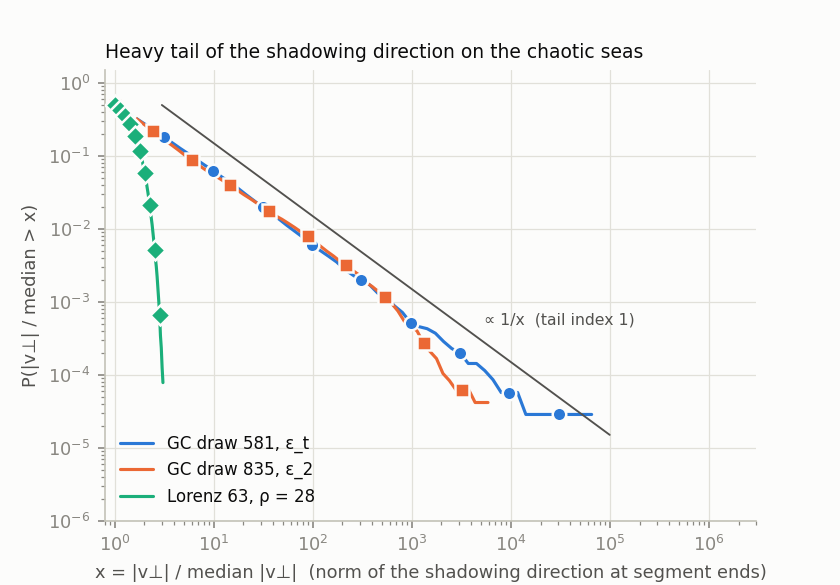

# Can I trust this sensitivity?

NILSS differentiates long-time averages of chaotic flows by *shadowing*: it assumes that every orbit of the perturbed system
stays close to some orbit of the original system for all times. That is a property of uniformly hyperbolic attractors. (The
Lorenz 63 attractor is not one, but NILSS works well on it at rho = 28 and the checks below find nothing wrong.) Many systems that people want to differentiate do not have it:
Hamiltonian flows with a mixed phase space (islands, sticky regions), intermittent flows, attractors with homoclinic tangencies.
There NILSS still returns numbers, and the standard error that goes with a single run says nothing about how wrong they are.

`nilss_jax` therefore ships a **reliability report** (`nilss_jax.reliability_report`, also `EnsembleResult.report()`): a set of
checks on the output of an ensemble of runs that look for the known signatures of failure. This page explains what each check
measures, how it was calibrated, how to read a report, what to do when it complains, and where it is blind.

```python
ens = nilss_jax.run_ensemble(nilss, p, u0s, T=200.0, T_spinup=20.0)      # many orbits, not one
print(ens.summary())        # mean +- SEM, median with bootstrap interval, 10-90% range of the runs, verdict
print(ens.report())         # the individual checks
```

The verdict is one of `ok`, `caution`, `unreliable`. **`ok` means that none of the known failure signatures is present. It does not
mean that the answer is right.** For a sensitivity that matters, compare one parameter with finite differences
(`nilss_jax.fd.finite_difference`, see [below](#what-to-do-on-caution-or-unreliable)).

## What goes wrong

The shadowing direction `v` is computed along the orbit and the sensitivity is a time average of terms that contain `v`
(the per-segment contributions, `NILSSResult.segments`; their sum is `dJdp`). In the failing cases below the norm `|v|` has a power-law tail,

    P(|v| > x) ~ x^(-alpha),   alpha close to 1.

A plausible mechanism is a near-tangency between the stable and the unstable direction, where `|v|` is of order `1/sin(angle)`: if the
angles have a finite density at zero, the tail index is 1. That is an interpretation; the tail itself is what is measured.
Two things follow from `alpha < 2`. (i) The variance of the contributions is infinite: the central limit theorem does not apply, the
sample standard error is meaningless, and the sample mean is dominated by the largest terms (the top 1 % of the segments carry 16 - 62 %
of the sum of `|contribution|` in the guiding-center runs of [findings.md](findings.md)). (ii) The spread of the estimate does not decay
like `1/sqrt(T)`: for independent terms with tail index `alpha` between 1 and 2 it decays like `T^(1 - 1/alpha)`, that is with exponent
0.33 for `alpha = 1.5` and 0 for `alpha = 1`, where the average of N terms is as widely distributed as one term (the synthetic samples in the
table below give 0.32 and 0.02). A longer run does not help; more orbits help only slowly.



*Survival function of `|v⊥| / median`, pooled over the segment ends of all runs: both chaotic seas of the guiding-center flow follow the `1/x` guide
(tail index 1) over about three decades (the curves flatten where only one or two segments are left); Lorenz 63 at rho = 28 falls off steeply.*

## The checks

| check | what it measures | verdict thresholds | why |
|---|---|---|---|
| **number of runs** | orbits that pass the exponent filter | fewer than 8: caution | no statistics of the run-to-run scatter below that |
| **resolved exponent** | `lambda_1 * T` of the runs (median) | `>= 20` ok, `>= 3` caution, below: unreliable | NILSS needs a positive exponent that the trajectory resolves; runs below `min_lyap_time` (default 20) are left out of all statistics |
| **exponent spread** | runs whose `lambda_1` is below 0.3 x the median | any: caution | such orbits are probably on another component (on the guiding-center orbits a regular torus has a finite-time `lambda_1` of about 5e-5 against 3e-3 - 6e-3 on the sea) |
| **ergodicity** | spread of `<J>` over the runs divided by the sampling error of one run (from 20 block means of `J_segments`) | above 3: caution | one ergodic component gives about 1; large values mean the runs sample different parts of the phase space, or T is too short. Skipped if `J_segments` is not available |
| **tail of \|v\|** | Hill tail index of `|v|` at the segment ends, pooled over runs, per parameter | below 2: unreliable; below 4: caution | `alpha < 2`: infinite variance; `alpha < 4`: infinite kurtosis, error bars of the error bars unreliable |
| **tail of segments** | the same for `|contribution|` per segment, plus the share of the top 1 % of the segments | same | the quantity that is actually summed |
| **error scaling** | exponent `a` of the interquartile range of the estimate from sub-runs of `L` segments, `IQR(L) ~ L^-a` | below 0.2: unreliable; below 0.35: caution | independent terms with finite variance give 0.5 (Lorenz 63 measures 0.76 - 0.90 at rho = 28 and 35, 0.3 - 0.5 at rho = 40); Cauchy-like terms give 0 |
| **nus consistency** (optional, `nus_check=`) | the same orbits rerun with one more homogeneous tangent: how many change by more than 3 robust sigma (MAD) | any: caution | with all unstable directions included the answer must not depend on `nus` |

The Hill index is computed from the `k` largest values, with `k = 5 %` of the pooled sample limited to `[20, 1000]`
(`nilss_jax.tail_index`; `nilss_jax.hill_index(x, k)` takes `k` explicitly). The estimate depends on `k` when the tail is not a
pure power law ([calibration.txt](../experiments/reference_results/calibration.txt) prints it for `k = 50, 100, 300, 1000`):
for guiding-center draw 581 it is 0.98 - 1.04 at every `k`, for draw 835 it goes from 1.5 (`k = 50`) to 0.96 (`k = 1000`); for Lorenz 63 at rho = 28 it is 9 - 30.

## How to read a report

The report of 48 NILSS runs of `T = 2e5` on the chaotic sea of guiding-center draw 835 (`nilss-jax gc --draw 835` runs a short
version; the numbers are in [calibration.txt](../experiments/reference_results/calibration.txt)):

```
NILSS reliability report: 48 of 48 runs used
  ok          number of runs            48
  ok          resolved exponent         median lambda_1 = 0.003054, lambda_1 T = 611
  ok          exponent spread           0 of 48 runs below 0.3 x the median exponent
  skipped     ergodicity                spread of <J> over the runs / sampling error of one run = nan
  UNRELIABLE  tail of |v| [eps_2]       Hill index 0.96   (index < 2: infinite variance, the standard errors are meaningless)
  UNRELIABLE  tail of segments [eps_2]  Hill index 0.95, top 1% of the segments carry 45% of sum |contributions|
  UNRELIABLE  error scaling [eps_2]     spread ~ L^-0.17 (0.5 expected)   (the estimate converges much more slowly than 1/sqrt(T))
  ...         (the same three lines for eps_h, kappa and iota)
verdict: UNRELIABLE. The sample mean has infinite variance or the assumptions are not met: the printed standard errors are meaningless ...
```

The first lines say that the orbits are on a chaotic component with a resolved exponent (the ergodicity check is skipped because the stored
runs carry no `J` per segment). The tail lines say what is wrong: the
norm of the shadowing direction has a tail index of about 1 and a few percent of the segments carry half of the sum. Read the numbers: an index of 1.0 over
the whole range of `k` is a power law; an index that is high at large `k` and low only for the 50 largest values means a few rare events.

## Calibration

`experiments/scripts/calibrate_reliability.py` runs the report on systems where NILSS is known to work, on less well behaved ones,
on the stored guiding-center runs and on synthetic samples with known tails, and measures the stability of the verdict under
sub-sampling (200 random subsets of 8 and of 16 orbits; the first 25 % and 50 % of the segments of every orbit).
Full output: [experiments/reference_results/calibration.txt](../experiments/reference_results/calibration.txt).

| system | T per orbit | orbits | verdict | Hill index of \|v\| | Hill index of segments | error-scaling exponent | subsets of 8 orbits flagged | NILSS mean vs finite differences |
|---|---|---|---|---|---|---|---|---|
| Lorenz 63, rho = 28 | 200 | 32 | ok | 10.3 | 28.8 | 0.83 | 0 % | 1.017 vs 1.002 +- 0.001 |
| Lorenz 63, rho = 28 | 1000 | 32 | ok | 13.7 | 57.7 | 0.76 | 0 % | 1.017 vs 1.002 +- 0.001 |
| Lorenz 63, rho = 35 | 200 | 32 | ok | 10.3 | 13.6 | 0.90 | 0 % | 1.002 +- 0.0004 vs 1.000 +- 0.001 |
| Lorenz 63, rho = 35 | 1000 | 32 | ok | 12.4 | 9.2 | 0.79 | 0 % | 0.998 +- 0.004 vs 1.000 +- 0.001 |
| Lorenz 63, rho = 40 | 200 | 32 | ok | 6.0 | 5.4 | 0.46 | 12 % caution | 1.06 +- 0.05 vs 0.982 +- 0.001 |
| Lorenz 63, rho = 40 | 1000 | 32 | caution | 5.5 | 3.1 | 0.31 | 10 % caution | 1.00 +- 0.01 vs 0.982 +- 0.001 |
| Lorenz 96, 8 variables, F = 8 (`nus = 2`) | 500 | 32 | **unreliable** | 1.17 | 1.12 | 0.08 | 100 % | 3.6 +- 1.3 vs 3.687 +- 0.009 |
| Roessler, c = 5.7 | 1000 | 32 | **unreliable** | 1.20 | 1.21 | 0.08 | 100 % | 0.07 +- 0.015 vs 0.095 +- 0.006 (a) |
| guiding-center sea, draw 581 | 2e5 | 35 | **unreliable** | 0.99 | 1.02 | 0.15 | 100 % | wrong sign for 3 of 4 parameters |
| guiding-center sea, draw 835 | 2e5 | 48 | **unreliable** | 0.96 | 0.95 | 0.14 | 100 % | 2 of 4 agree |
| synthetic, Gaussian | 500 | 16 | ok | 8.5 | 5.6 | 0.52 | 0 % | - |
| synthetic, Pareto index 1.5 | 500 | 16 | **unreliable** | 1.49 | 1.49 | 0.32 | 100 % | - |
| synthetic, Pareto index 1 | 500 | 16 | **unreliable** | 0.99 | 0.99 | 0.03 | 100 % | - |

The table gives the smallest index over the parameters of each system. (a) The finite-difference response of the Roessler `<z>` to
`c` is not linear over the window used (chi2/dof 355/3), so that reference is only indicative. Lorenz 63 rows use `T_seg = 0.5`, `dt = 0.005`; Lorenz 96 `T_seg = 0.5`, `dt = 0.01`; Roessler `T_seg = 1`, `dt = 0.01`; the guiding-center rows are the stored runs of `docs/findings.md`.

What the calibration shows:

* **No false alarm on Lorenz 63 at rho = 28 and 35.** The verdict is `ok` for the full ensembles, for every one of 200 random subsets of
  8 orbits (and of 16, for the 32-orbit ensembles), and for the first 25 % and 50 % of the segments (T = 50 ... 500). Synthetic Gaussian
  samples also pass in all 200 draws of 8.
* **No miss among the known bad cases.** Both guiding-center seas, the Pareto samples, Lorenz 96 and the Roessler attractor are
  `unreliable` in all 200 draws of 8 orbits (and of 16, where the ensemble has more than 16) and for both truncations.
* **Lorenz 63 at rho = 40 is borderline** (caution at T = 1000; 10 - 12 % of the 8-orbit subsets are flagged, 1 - 3 % of the 16-orbit ones).
* **Lorenz 96 and the Roessler attractor were not expected to fail, and they do:** both have a tail index near 1.2. Their NILSS means
  agree with finite differences (Lorenz 96: 3.61 +- 1.3 against 3.687; the median of the runs, 3.63, also), but only after averaging 32
  orbits, with a standard error of 36 % (Lorenz 96) and 22 % (Roessler), and the runs spread over [-0.06, 6.2] (Lorenz 96, 10 - 90 %).
  The verdict is right in the sense that matters: the printed error bar cannot be trusted and a single run is useless.
* **`nus` consistency**: Lorenz 63 at every rho tested: unchanged (largest change of one orbit 3e-4). Guiding-center draw 581: caution for all four
  parameters (the mean of `eps_t` over the 9 orbits that were run with both settings goes from -0.88 to +0.37); draw 835: caution for all four.
  Lorenz 96 `nus = 2 -> 3`: not flagged although one orbit changes by 2.0, because the robust spread of the runs is large.

## What to do on `caution` or `unreliable`

1. **Check against finite differences.** For a long-time average of an ergodic system it needs no tangent equations
   (`nilss_jax.fd.finite_difference`; `nilss_jax.fd.compare(ens, {'rho': fd})` prints the comparison). Cost: `npoint * ncopy * (T + T_spinup) / dt`
   Runge-Kutta steps. Use `select=` to leave out copies that sit on regular tori, and `project=` to put the copies back on an energy shell.
2. **Use more orbits, not longer ones.** With a power-law tail a longer `T` does not shrink the spread of one run (exponent `a` above);
   more orbits average out the rare events at the rate that the tail allows. In the guiding-center runs about 50 orbits of `T = 2e5` were needed
   for a standard error of 0.3 on one sensitivity.
3. **Look at the median and at the spread of the runs**, not only at the mean and its standard error. A median is robust to the rare events but
   is not the mean (it is a biased estimate of it when the tails carry part of the answer); `EnsembleResult.median_interval()` gives its bootstrap interval.
4. **Check the exponents first.** `nilss_jax.lyapunov.lyapunov_spectrum` shows whether there is a positive exponent, how many (`nus`), and
   whether an invariant (energy) creates a second neutral direction (use `invariant=`).
5. **Try `nus + 1`** (`run_ensemble` with the same `u0s`, `reliability_report(runs, nus_check=more_runs)`): when the answer changes, the unstable
   subspace is not captured by the tangents of one run.
6. **Change the question.** A smoother objective `J`, a finite-horizon ensemble objective (the pathwise gradient is valid up to a few Lyapunov times,
   see [findings.md](findings.md#finite-time-ensemble-objectives)), or independent finite differences may serve better than a long-time-average sensitivity.

## Where the report is blind

* **An `ok` verdict does not detect a bias with light tails.** In Lorenz 63 at rho = 28 every check passes, the run-to-run scatter is 4e-4,
  and the NILSS mean (1.017) differs from the finite-difference slope over rho = 26 ... 30 (1.002 +- 0.001) by 1.5 %, 15 combined standard errors.
  The cause was not investigated (shadowing bias, the finite-difference window, discretisation); the point is that the standard error of NILSS does
  not contain such systematic differences.
* **Lorenz 63 at rho = 28: the `sigma` sensitivity is 11 % off, and the report only says `caution`.** With `rho`, `sigma` and `beta` differentiated together
  (`T = 200`, 32 orbits) NILSS gives +1.017, +0.1332 and -1.657; finite differences over independent orbits (64 copies, windows of 0.1 to 0.5 in `sigma`, `T` up to 8000) give about
  +1.00, +0.150 +- 0.004 and -1.642 +- 0.006. The `sigma` value does not move with `T` (0.1334 at 200, 0.1338 at 2000), `nus` (1, 2), `T_seg` (0.1, 0.5, 2) or `dt` (0.1327 at 0.0025),
  and the NILSS output satisfies the exact identities of the invariant measure: `d<xy - beta z>/dp` (the average of `dz/dt`) is -0.0004 (`rho`) and -0.0001 (`sigma`), `d<xy>/dsigma = 0.3556`
  against `beta d<z>/dsigma = 0.3557`, `d<x^2>/dsigma = 0.3557`. So this is not an error in the time-dilation term or the code: it is the difference between the shadowing estimate and the derivative
  of the average on a non-uniformly-hyperbolic attractor. The only signal is `caution` on the per-segment tail of `sigma` (Hill index 2.4 - 2.6; `rho` and `beta` are `ok`), which is why that check
  stays at `caution` for indices below 4 although it also fires on benign cases.
* **Rare outlier orbits are not seen at the default `k`.** Lorenz 63 at rho = 35 (T = 1000) has two orbits at 0.873 and 0.957 against 1.002 for the bulk
  (robust sigma 0.0007), and rho = 40 has orbits at 2.57 (T = 200) and 1.34, 0.82 (T = 1000) against 0.994 (robust sigma 0.009 - 0.014): the standard
  error of the mean grows tenfold (0.0004 -> 0.0043 at rho = 35) and the gap between mean and median shows it, but the tail checks are at `ok` or `caution`,
  because a handful of events among 12 800 - 64 000 segments is below the sample fraction at which the Hill index is evaluated (at `k = 50`
  the index is 3.9 at rho = 35 and 0.95 - 1.2 at rho = 40).
* **`unreliable` does not mean wrong.** In guiding-center draw 835 the NILSS means for `eps_2` (+0.94 +- 0.32 against +0.80 +- 0.05) and
  `iota` (+0.074 +- 0.041 against +0.11 +- 0.005) agree with the finite differences although the verdict is `unreliable`; for `eps_h` (-0.57 +- 0.02 against -0.86 +- 0.03)
  and `kappa` (+0.22 +- 0.03 against +0.01 +- 0.006) they do not, and the small standard errors there are no guide either. The verdict says that the error bar cannot be trusted.
* **The `nus` check is weak when the runs scatter widely** (Lorenz 96, above) and needs the second ensemble.
* **The thresholds are heuristics**, set on the systems of the table; they were not derived from a theory of the estimator and were not tested on systems
  with many parameters or high dimension. Treat a verdict near a threshold (an index of 3 - 5, an exponent of 0.3 - 0.4) as a prompt to run finite differences.

See also: [findings.md](findings.md) (the guiding-center study), [usage.md](usage.md), [theory.md](theory.md).
